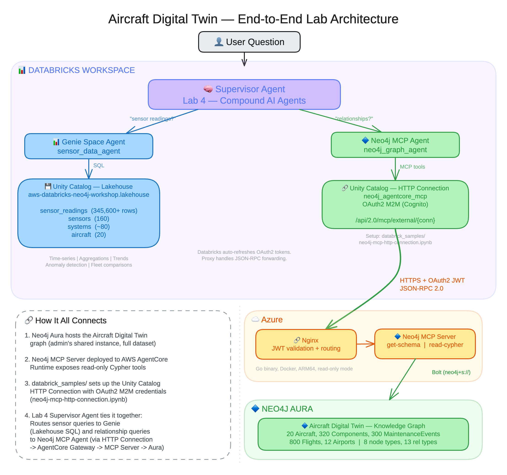
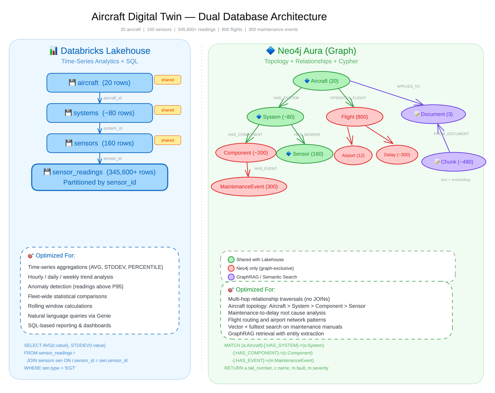

[Workshop Site](https://neo4j-partners.github.io/databricks-neo4j-workshop)

# Hands-On Workshop: Neo4j and Databricks

## What You Will Build

By the end of this workshop you will have a working AI system that answers natural language questions about a commercial aviation fleet, deployed as an endpoint and remembering what it has been asked before. Ask it a question and a supervisor decides which specialized backend can best answer it.

The system answers three fundamentally different kinds of questions:

- **Time-series analytics questions** such as "How have engine temperature readings trended over the last 90 days?" are best answered by running SQL over columnar data.
- **Relationship questions** such as "Which components have had critical failures, and which flights did those failures delay?" are best answered by traversing a graph.
- **Documentation questions** such as "What does the manual say about EGT exceedance?" are best answered by semantic similarity over text, then traversal from what matched.

A single database handles one of these well. This workshop pairs Neo4j and Databricks so each handles the workload it is built for, connects them through an agent that routes between them, and then puts the agent's memory in the graph next to the fleet data so the two can be queried together.

The question the whole workshop builds toward needs all three at once: *which engines show abnormal EGT, what is their maintenance history, and what is the relevant procedure?*

The dataset is an Aircraft Digital Twin: a simulated aviation fleet with real structure. Aircraft have systems and components. Components generate sensor readings and accumulate maintenance events. Aircraft operate flights between airports, and those flights can have delays tied to specific component failures. The combination gives you a realistic, richly connected dataset that exercises both the graph and the analytics platform.

---

## Workshop Architecture

The end-to-end architecture routes each user question to the backend best suited to answer it:

- **Supervisor**: receives user questions and decides which specialized tool to call. You build it in LangGraph in Lab 5, and see it built with no code in the Lab 4 Part B demo
- **Genie tool**: handles sensor telemetry analytics using natural language SQL over Unity Catalog tables
- **Cypher tool**: handles graph traversal over aircraft topology, maintenance history, and flight operations
- **GraphRAG tool**: handles maintenance documentation using vector search over manual chunks, then traversal from the chunks that match
- **Neo4j Aura**: the graph database holding all three of relationships, documentation, and the agent's own memory
- **Databricks**: provides notebooks, Foundation Model APIs, and Model Serving

The Lab 4 Part B demo builds the same routing over the **Model Context Protocol**, which is the pattern for centrally-governed agent access to Neo4j and where this integration is heading. The instructor runs it. Participants watch.



## Dual Database Architecture

The workshop is built on a dual database architecture that assigns each workload to the platform best suited for it:

- **Databricks Lakehouse** handles high-volume time-series sensor telemetry, optimized for aggregations, trend analysis, and statistical queries over columnar data.
- **Neo4j Aura** stores the richly connected relational data: aircraft topology, component hierarchies, maintenance events, flights, and airport routes, traversing multi-hop relationships natively without expensive JOINs.



---

## Overview

Participants work through lab exercises in Databricks and Neo4j Aura, using Databricks as the notebook environment for ETL, multi-agent orchestration, and semantic search.

### Data Overview

The workshop uses a comprehensive **Aircraft Digital Twin** dataset that models a complete aviation fleet over 90 operational days. The data is split across two platforms, each chosen for the workload it handles best:

- **Databricks Lakehouse** stores the **time-series sensor telemetry**, roughly 155K readings across 90 days. Columnar storage and SQL make the Lakehouse ideal for aggregations, trend analysis, and statistical comparisons over large volumes of timestamped data.
- **Neo4j Aura** stores the **richly connected relational data**: aircraft topology, component hierarchies, maintenance events, flights, delays, and airport routes. A graph database handles multi-hop relationship traversals natively, avoiding the expensive JOINs a tabular database would require for queries like "Which components caused flight delays?"

Together the dataset includes:

- **Aircraft** with tail numbers, models, and operators
- **Systems** (Engines, Avionics, Hydraulics)
- **Components** (Turbines, Compressors, Pumps, etc.)
- **Sensors** with monitoring metadata
- **Sensor Readings** (telemetry every 4 hours over 90 days)
- **Flights** with departure/arrival information
- **Maintenance Events** with fault severity and corrective actions
- **Airports** in the route network

### Key Technologies

| Technology | Purpose |
|------------|---------|
| **Neo4j Aura** | Graph database for storing aircraft relationships |
| **Databricks** | Notebooks, Unity Catalog |
| **AI/BI Genie** | Natural language analytics over Unity Catalog tables |
| **LangGraph** | Code-first supervisor routing across Genie, Cypher, and GraphRAG tools |
| **GraphRAG** | Graph-enhanced retrieval combining vector search with graph traversal |
| **Neo4j Spark Connector** | ETL from Databricks to Neo4j |
| **Model Serving** | Deploying the agent as an endpoint that authenticates as a service principal |
| **Neo4j Agent Memory** | Conversation memory stored as a graph alongside the domain data |
| **Agent Bricks: Supervisor Agent** | No-code multi-agent supervisor. Demonstrated in Lab 4 Part B |
| **Model Context Protocol (MCP)** | Standard for connecting AI models to data sources. The pattern for centrally-governed agent access to Neo4j, demonstrated in Lab 4 Part B |

---

## Workshop Structure

### Phase 1: Setup

*Get connected to all workshop resources.*

| Lab | Description | Time |
|-----|-------------|------|
| [Lab 1 - Neo4j Aura Setup](./Lab_1_Aura_Setup) | Create an Aura free trial, save credentials, learn Cypher basics | 20 min |

---

### Phase 2: Databricks ETL & Semantic Search

*Load aircraft data into Neo4j, then add semantic search capabilities: chunk maintenance documentation, generate vector embeddings, and build GraphRAG retrievers.*

| Lab | Description | Time |
|-----|-------------|------|
| [Lab 2 - Databricks ETL to Neo4j](./Lab_2_Databricks_ETL_Neo4j) | Load Aircraft Digital Twin data into Neo4j using the Spark Connector | 45 min |
| [Lab 3 - Semantic Search](./Lab_3_Semantic_Search) | Load maintenance manual, generate embeddings, build GraphRAG retrievers | 45 min |

---

### Phase 3: Multi-Agent Analytics

*Build a multi-agent supervisor that combines the Databricks Lakehouse with the Neo4j knowledge graph, then give it memory.*

| Lab | Description | Time |
|-----|-------------|------|
| [Lab 4 Part A - Genie Space](./Lab_4_Compound_AI_Agents/PART_A.md) | Natural language SQL over sensor telemetry in Unity Catalog | 30 min |
| [Lab 5 - LangGraph Agent](./Lab_5_LangGraph_Agent) | A supervisor routing across Genie, Cypher, and GraphRAG, deployed to Model Serving | 90 min |
| [Lab 6 - Agent Memory](./Lab_6_Agent_Memory) | Memory that lives in the same graph as the fleet data, so both can be traversed together | 75 min |

---

### Instructor Demo

| | Description |
|-----|-------------|
| [Lab 4 Part B - No-Code Supervisor](./Lab_4_Compound_AI_Agents/PART_B.md) | The same routing built with no code, using Agent Bricks and a governed Neo4j MCP connection over Unity Catalog. The instructor runs it against their own demo instance. Participants watch and need no Aura instance, MCP connection, or credential |

---

### Optional and Advanced

*Take-home material. Not required to finish the workshop.*

| Lab | Description | Time |
|-----|-------------|------|
| [Appendix A - GDS Graph Analytics](./Appendix_A_GDS_Graph_Analytics) | Centrality, community detection, and similarity over the fleet graph | 45 min |

---

## Which Aura Instance Each Lab Uses

Every required lab reads and writes the **one Aura instance you create in Lab 1**, and each lab's output is the next lab's input. Lab 2 loads the fleet, Lab 3 adds documentation and vector indexes to it, Lab 5 builds an agent that queries both, and Lab 6 writes the agent's memory back into it.

| Lab | Neo4j target |
|-----|--------------|
| Lab 1, 2, 3 | Yours |
| Lab 4 Part A | None. Genie queries Unity Catalog |
| Lab 4 Part B | None of yours. The instructor's demo instance, in a demo the instructor runs |
| Lab 5, 6 | Yours |

---

## Prerequisites

- **Laptop** with a modern web browser
- **Network Access** to Databricks and Neo4j Aura
- Neo4j Aura free trial account (created in Lab 1)
- Databricks workspace with Model Serving enabled
- No local software installation required

---

## Knowledge Graph Schema

The knowledge graph models a commercial aviation fleet as a connected network of physical things, operational events, and documentation.

- **Aircraft and their physical structure.** Each aircraft has a tail number, model, and operator. An aircraft contains three main systems: Engines, Avionics, and Hydraulics. Each system contains multiple components. Engines hold turbines and compressors; hydraulic systems hold pumps and actuators. Every component is monitored by one or more sensors that record health and performance readings.

- **Maintenance history.** When a component develops a fault, a maintenance event is recorded against that component. Each event captures the fault description, its severity, the corrective action taken, and when it was reported. Some components are physically removed and replaced, creating a removal record linked to the maintenance event that triggered it.

- **Flight operations.** Aircraft operate flights between airports. Each flight has a flight number, departure airport, and arrival airport. A flight can have one or more delays, and each delay records its cause and duration in minutes. Delays can be traced back through the graph to the specific component failure that caused them.

- **Maintenance documentation.** Technical maintenance manuals are stored as documents and broken into overlapping chunks for semantic search. Each chunk carries a vector embedding so the system can retrieve relevant passages using natural language queries. Chunks link back to their source document and chain to adjacent chunks for context.

## Technology Stack

| Component | Technology |
|-----------|------------|
| Graph Database | Neo4j Aura |
| Embeddings | Databricks BGE-large (databricks-bge-large-en) |
| LLM | Databricks Llama 3.3 70B |
| Vector Search | Neo4j Vector Index |
| Multi-Agent | LangGraph. Databricks Agent Bricks in Lab 4 Part B |
| Agent Memory | neo4j-agent-memory on the participant's own Aura instance |
| Deployment | Databricks Model Serving |
| ETL | Neo4j Spark Connector |

## Configuration

Each notebook has a **Configuration** cell at the top where you enter your Neo4j credentials:

```python
NEO4J_URI = "neo4j+s://xxxxxxxx.databases.neo4j.io"
NEO4J_USERNAME = "neo4j"
NEO4J_PASSWORD = "your_password_here"
```

Databricks notebooks use Foundation Model APIs, which handle authentication automatically when running in Databricks.

## Resources

### Neo4j
- [Neo4j Aura Documentation](https://neo4j.com/docs/aura/)
- [neo4j-graphrag Python Library](https://neo4j.com/docs/neo4j-graphrag-python/)
- [Neo4j MCP Server](https://github.com/neo4j/mcp)
- [Neo4j Spark Connector](https://neo4j.com/docs/spark/current/)
- [Cypher Query Language](https://neo4j.com/docs/cypher-manual/current/)

### Databricks
- [Foundation Model APIs](https://docs.databricks.com/aws/en/machine-learning/foundation-model-apis/)
- [AI/BI Genie](https://docs.databricks.com/aws/en/genie/)
- [Agent Bricks: Supervisor Agent](https://docs.databricks.com/aws/en/generative-ai/agent-bricks/multi-agent-supervisor)
- [Databricks Unity Catalog](https://docs.databricks.com/en/data-governance/unity-catalog/)

## Feedback

We appreciate your feedback! Please open an issue on the [GitHub repository](https://github.com/neo4j-partners/databricks-neo4j-workshop/issues) for bugs, suggestions, or comments.
