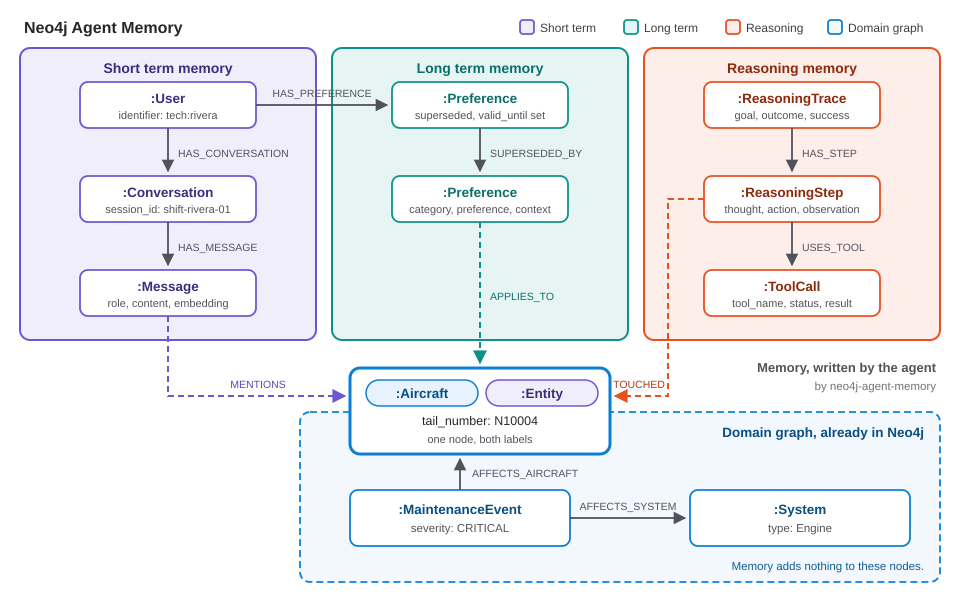

<style>
section {
  --marp-auto-scaling-code: false;
}

li {
  opacity: 1 !important;
  animation: none !important;
  visibility: visible !important;
}

/* Disable all fragment animations */
.marp-fragment {
  opacity: 1 !important;
  visibility: visible !important;
}

ul > li,
ol > li {
  opacity: 1 !important;
}
</style>

# Intro to Agent Memory

Giving the Lab 5 supervisor a memory, in the graph it already queries

<!--
Thirteen slides, about 19 minutes. Assumes GraphRAG and the Lab 5
supervisor are already taught. Lands on Lab 6's own demo.

CUTTING TO 15 MINUTES: fold Hot Path Versus Background Write into
the one line already written on recall, then act, then remember,
and skip Hot Path entirely. NEVER cut The Payoff. The Payoff is
the argument for the whole lab.

Memory Has to Handle Being Wrong and Hot Path Versus Background
Write are the soft middle: most interesting to a practitioner,
least connected to anything a participant runs. If the room is
drifting, that is where it happens. Memory Has to Handle Being
Wrong keeps its place because there is a live demo behind it. Hot
Path has none.
-->

---

## What This Covers

- **The amnesiac.** The Lab 5 supervisor holds nothing from the question before
- **The fake fix.** Replaying the transcript costs, distracts, and contradicts itself
- **Three layers, one graph.** Short term, long term, reasoning, beside the fleet
- **Being wrong.** Supersede the old belief, keep it, stamp when it stopped being true
- **recall, act, remember.** Two nodes added, and one query that crosses both halves

<!--
0.5 minutes. Read the five lines. Do not explain them.

The one to point at is the last. Everything above it is memory
the way any product does memory. The last line is the part that
only works because the memory lives in the fleet graph, and it
is where the deck ends up.

IF THE DAY IS RUNNING LATE, cut in this order. This slide goes
first, and costs nothing. Then the Summary near the end, down to
its Next line. Only then the Hot Path slide, which is already
marked as the cut that takes the deck under its original budget.
Never cut The Payoff.
-->

---

## The Agent You Built Is an Amnesiac


- **Lab 5 shipped this:** one supervisor, three tools, one endpoint. It routes well and it answers well
- **Ask it about `N10011`.** Then ask "any maintenance events on that aircraft?" and it has no idea what *that* means
- **At the start of question two it holds** the question, the schema and the prompt. Nothing about question one
- **Close the notebook** and everything it worked out is gone

**"Most agents you build today are amnesiacs."**

<!--
1.0 minute.

Put the Lab 5 topology back up first. The room built this
yesterday or an hour ago, and the point lands harder against
something they recognise as good work.

The analogy to use out loud: a contractor whose memory is wiped
every time they walk out of the hangar. Brilliant while they are
in the room. You brief them from scratch every single morning,
and they never notice the thing they saw three days running.

This is not a criticism of the Lab 5 agent. Every claim on the
Lab 5 page still stands. The supervisor is stateless by
construction, and that is the correct default until you decide
otherwise on purpose.
-->

---

## The Fake Fix, and Where It Runs Out

- **The obvious move:** stuff the whole transcript back into the prompt every turn
- **Cost.** Every turn pays for every turn before it, forever
- **Distraction.** Context rot: the model's performance drops as the window fills with material that is not about this question
- **Contradiction.** The wrong answer from Monday and the corrected one from Tuesday sit side by side, and nothing in the window says which won
- **The second obvious move:** dump the transcript into a vector store

**"Your 'memory' is just a pile of text chunks ranked by cosine similarity."**

<!--
1.5 minutes.

Context rot was taught in the GenAI foundations deck. One
sentence of callback is enough; do not re-teach it.

The contradiction failure is the one to dwell on, because it
sets up Memory Has to Handle Being Wrong. Both statements are in
the window, both are fluent, both name the same aircraft, and
retrieval has no principled way to prefer one. The model picks
whichever it happened to attend to.

Name the field once, here, so nobody thinks this is a Neo4j-only
problem: LangGraph's own checkpointers and store are where most
people put this first, and mem0, Zep/Graphiti and Letta are the
dedicated products. They are all solving the same three failures
above.
-->

---

## Three Layers, One Graph


- **Short term.** The shift log. This conversation and recent ones: messages, who said them, which entities they mention
- **Long term.** The permanent record. Preferences and durable facts that outlive any one session
- **Reasoning.** The mechanic's own notebook of how they worked it out: traces, steps, tool calls, what worked
- **Reasoning memory is the differentiator.** A vector store has nowhere to put "which tool I tried, what it returned, and whether that was the right call"

<!--
2.0 minutes.

These three are not a taxonomy invented for the slide. They are
the three namespaces on the client the lab actually calls:
client.short_term.add_message, client.long_term.add_preference,
client.reasoning.start_trace. If someone opens memory.py during
the break, the words match.

ONE SENTENCE ON THE TAXONOMY CONFLICT, then move on. Neo4j ships
two. The 2025 developer blog, Alex Gilmore, borrows LangGraph's
split of short-term versus long-term, with long-term dividing
into semantic, episodic and procedural. The 2026 Labs and
hosted-service line uses short-term, long-term and reasoning.
This deck and Lab 6 use the 2026 one, because that is what the
code participants run is built on. Cite Gilmore as the
cross-walk for anyone who reads the blog afterwards, and do not
spend a slide arguing about it.

Second analogy if the room wants one: Letta describes its
hierarchy as an operating system. Core memory is RAM, recall is
disk cache, archival is cold storage. It is the cleanest
borrowed picture of why the layers are separate.
-->

---



<!--
1.5 minutes. No title on this one on purpose. The picture is full
bleed and you are the caption.

Walk it in four moves, finger on the screen.

  Short term: a User, a Conversation, the Messages inside it.
  This is the only layer the participant notebook writes.

  Long term: the durable record. Preferences, which supersede one
  another rather than overwrite.

  Reasoning: a trace, the steps inside it, the tool calls those
  steps made.

  Then the right hand side, which the room built in Lab 2:
  Aircraft, Systems, Components, MaintenanceEvents. Colour is
  doing the grouping. Each layer has its own.

Land on the one edge that crosses: MENTIONS, from a Message to an
Aircraft. Put a finger on it and say the sentence out loud.
"After adoption that is not a copy of the aircraft. It is the
aircraft." One node wearing two labels, :Aircraft and :Entity.

That edge is the whole lab. Everything left of it is memory any
product will sell you. Everything right of it is the fleet. The
edge is what makes the query on The Payoff slide possible at all.

IF YOU ARE SHORT ON TIME, show the picture, say that last
paragraph, and move on. Thirty seconds.
-->

---

## Why a Graph, in One Query

```cypher
MATCH (:ReasoningTrace)-[:HAS_STEP]->(s:ReasoningStep)-[:USES_TOOL]->(tc:ToolCall)
MATCH (s)-[:TOUCHED]->(ac:Aircraft)
RETURN ac.tail_number AS aircraft, tc.tool_name AS tool,
       tc.status AS status, s.observation AS observation
```

- **Read the path out loud:** a reasoning trace, to the step inside it, to the tool that step called, to the aircraft that call touched
- **The question it answers:** which agent decisions touched this aircraft, and which of them failed
- **`:TOUCHED` hangs off the step**, not the tool call: step to entity for the audit, step to call for the mechanics
- **In a system where traces are log lines and the fleet is a database,** that question is a support ticket

**"Vector stores give you recall; the graph gives you understanding."**

<!--
2.0 minutes. This is the thesis slide.

Walk the path with a finger on the screen. Do not read the
Cypher as Cypher. Read it as a sentence: trace, step, tool call,
aircraft.

This query is verbatim from Demo 4 of
Lab_6_Agent_Memory/02_instructor_demos.ipynb. It runs. If the
room wants proof, that is the notebook to open.

The one caveat to say out loud, because it comes back on The
Payoff: that last MATCH only resolves because the lab adopted
the fleet's Aircraft nodes. Without adoption the memory library
creates its own N10011 Entity beside yours, the pattern matches
nothing, and you are back to two stores joined by string
comparison in Python.
-->

---

## Memory Has to Handle Being Wrong

- **mem0.** v2 had an LLM decide ADD, UPDATE or DELETE per fact. That proved fragile, so v3 went ADD-only and pushed contradiction into retrieval ranking instead
- **Zep and Graphiti.** Invalidate bi-temporally and never discard anything
- **Lab 6.** Supersedes: an edge from old to new, and the old one's `valid_until` stamped with the moment it stopped being true

```cypher
MATCH (old:Preference)-[:SUPERSEDED_BY]->(new:Preference)
RETURN old.preference AS superseded,
       old.valid_until AS stopped_being_true,
       new.preference  AS replacement
```

- **State Clock versus Event Clock:** what is true now, against what happened, when, and why

<!--
2.0 minutes. There is a live demo behind this one, which is why
it survives a shortened day and Hot Path Versus Background Write
does not.

DEMO BEAT, Demo 1 of 02_instructor_demos.ipynb. Run it or narrate
it.

  Monday: add_preference says the EGT exceedance on N10004 is on
  the number two engine.
  Tuesday: the borescope says otherwise. A second preference
  says number ONE engine, then supersede_preference(old, new).

  get_preferences_for(user_identifier=TECH, active_only=True)
    -> the number ONE engine. What the agent believes now.

  get_preferences_for(..., active_only=False,
                      as_of=BEFORE_CORRECTION)
    -> the number two engine. What it believed on Monday.

  Nothing was deleted. The wrong answer is still in the graph,
  still attached to the aircraft, still attached to the
  technician who gave it, stamped with the moment it stopped
  being true.

The line that makes the room sit up: an audit can reconstruct
exactly what the agent knew at any point. Delete the row instead
and you have an agent that cannot explain itself in an incident
review.

Do not pitch this as Neo4j beating mem0. Three live systems made
three defensible calls. The point is that "handles being wrong"
is a design decision you have to make, not a feature you get.
-->

---

## Hot Path Versus Background Write

- **Two choices, and only two.** Write during the turn and pay the latency, or write after the turn and accept staleness
- **Lab 6 writes on the hot path.** `recall` costs 3 to 5 seconds, `remember` about 11, so roughly 15 seconds a question
- **That is a good trade for a shift-handover agent** where the questions are few and the context is everything, and a bad one for a high-volume lookup endpoint
- **Push it to the background and staleness becomes the question:** how far behind is memory right now?
- **The hosted service exposes queue lag as a freshness SLI**, which makes staleness a number rather than a vibe

<!--
1.5 minutes, and THIS IS THE SLIDE TO CUT if the day is running
late. Fold it into the one line already on recall, then act, then
remember, and move on.

The Lab 6 numbers are measured, from Section 9 of
01_agent_memory.ipynb, against live Aura and live Databricks
Foundation Model endpoints. Say that they are measured. The
honest version of this lab prints its own latency cost and lets
the participant decide.

The reason Lab 6 stays on the hot path is teaching, not
engineering: a participant who cannot see the write happen
cannot debug it. A production handover agent would move the
write off the turn.
-->

---

## recall, then act, then remember

```
  Lab 5                          Lab 6

  question                       question -> recall
     |                                        |
  supervisor <--+                  supervisor <--+
     |          |                     |          |
     +-> genie / cypher / graphrag ---+ (unchanged)
     |                                |
  synthesize                       synthesize -> remember
     |                                             |
   answer                                       answer
```

- **Two nodes added. Three tools untouched.** The supervisor is the same node with a `{recalled}` block in front of its prompt
- **`recall` runs once per question, not once per tool call.** That single decision keeps the cost from being three times worse
- **Memory is routing context for the supervisor, not a fourth tool.** Nobody asks memory a question
- **It also rewrites the question.** The supervisor returns a `resolved` field, so "that aircraft" reaches Genie as `N10011`

<!--
2.0 minutes.

The point participants miss, and it is worth stating twice:
recall runs once per question. Wire it as a tool and the
supervisor can call it three times in one turn, at three to five
seconds each, for no extra information.

The rewrite is the half people do not anticipate. Memory that
only changes the ROUTE still hands the word "that" to Genie, and
Genie asks which aircraft you mean. The tools receive question
text, so the question itself has to be resolved before it
leaves the supervisor. Section 8 of the notebook shows the
resolved: line in the trace, on a question where the
participant never typed a tail number.

IF HOT PATH VERSUS BACKGROUND WRITE WAS CUT, this is where its
line goes: memory here
costs about 15 seconds a question, and recall running once per
question rather than once per tool call is the single decision
that keeps it from being three times worse.
-->

---

## The Payoff

- **Adoption, in one line.** Stamping `:Entity` onto the Lab 2 `Aircraft` nodes means a remembered aircraft **is** the fleet node, so one traversal crosses both
- **Adopt `Aircraft` and nothing else.** `adopt_existing_graph` sets `type` unconditionally, and `System`, `Sensor`, `Component` and `Document` all already use it. Adopting them corrupts the fleet graph silently
- **Fleet graph alone**, ranked by critical maintenance events: `N10011` comes **last of six**
- **Conversation memory alone**, ranked by distinct technicians asking: `N10011` is **joint first**
- **The joined query explains why:** three technicians, on three separate shifts, each pulled the EGT trend on `N10011` without knowing the others had

```cypher
MATCH (u:User)-[:HAS_CONVERSATION]->(c)-[:HAS_MESSAGE]->(m)-[:MENTIONS]->(ac:Aircraft)
WITH ac, count(DISTINCT u) AS technicians, ...
MATCH (ac)<-[:AFFECTS_AIRCRAFT]-(ev:MaintenanceEvent)-[:AFFECTS_SYSTEM]->(sys:System)
```

<!--
3.0 minutes. NEVER CUT THIS SLIDE. It is the argument for the
entire lab.

Show the three queries in order and let the ranking do the work.
Read separately, each list is unremarkable. An aircraft with few
critical events is fine. An aircraft several people asked about
is a busy week. Put them side by side and it is a different
sentence.

The analogy: the log is what got written down, the conversation
is what the crew keeps worrying about, and the gap between them
is where the next incident lives. Either those three technicians
are seeing something the record has not caught yet, or three
people each wasted a shift on the same dead end. Both are worth
a supervisor's attention. Neither list says it alone.

Line for line, the point is the (ac) on the second MATCH. It is
bound in the memory half and reused in the fleet half. Same
node. No join key, no federation, no second query. Without
adoption that ac would be a memory Entity that happens to share
a name with an Aircraft, and joining them means exporting both
sides and matching strings in Python. That code exists in a lot
of production systems, and it is where the tail number N10011
and the tail number "n10011 " go to disagree.

The adoption guard is a concept, not a step: it is what "the
same node" costs. memory.py refuses the four unsafe labels by
name rather than trusting the notebook to get it right, and the
notebook shows the refusal on purpose before it shows the
successful adoption.

OPTIONAL 30 SECONDS, from Demo 2. A preference scoped with
APPLIES_TO hangs off the aircraft, not the user:

  MATCH (ac:Aircraft {tail_number: $tail})<-[:APPLIES_TO]-(p:Preference)
  WHERE p.valid_until IS NULL
  RETURN p.category, p.preference

"On N10011 the EGT sensor reads about five degrees high" reaches
ANY technician who touches that aircraft, because it is a
property of the aircraft's situation rather than of one person's
profile. A preferences table keyed by user cannot express that
without a join nobody writes.
-->

---

## Context Graph: Where Memory Belongs

- **Databricks holds the telemetry.** Timestamped sensor values at volume, where scanning them is cheap
- **Neo4j holds the topology, the history, and now the memory.** Same instance, same nodes
- **Memory belongs on the side where the joins are.** Put it anywhere else and every question that spans both halves becomes an export and a string match
- **The cost is small.** About 20 nodes per participant per session, against roughly 178,000 nodes of headroom on AuraDB Free after Labs 1 through 3
- **AuraDB Free caps at 200,000 nodes and 400,000 relationships.** The arithmetic is why this fits on the tier the room is running

<!--
1.5 minutes. Close here.

The dual-database argument has run through the whole workshop.
This is the last instance of it and the cleanest: memory is
relationship-rich, low-volume data whose value is entirely in
what it connects to. That is the same test every other placement
decision in this workshop used.

THREE DIFFERENT THINGS SHARE THE "NEO4J MEMORY" NAME. Keep them
apart if anyone asks for links:

  1. mcp-neo4j-memory, the older MCP server under neo4j-contrib.
     Not what this lab uses.
  2. neo4j-agent-memory, the neo4j-labs library Lab 6 pins. This
     is what the lab runs.
  3. The hosted service, which is the source of the queue-lag
     SLI mentioned on Hot Path Versus Background Write.

Conflating them on a citation slide sends people to the wrong
repository.

One line on the pin, if asked: Lab 6 installs a fork wheel from
a Unity Catalog volume rather than a PyPI version, because the
released 0.5.0 silently drops most MENTIONS edges, and MENTIONS
is the exact edge The Payoff query walks. The fork fixes it.
The library is pre-1.0, so treat any upgrade as a code change
with its own test pass.
-->

---

## What Memory Adds to the Lab 5 Agent

- **Stateless is a default, not a law.** Two nodes either side of the supervisor change it
- **Memory is a graph, not a pile of chunks.** Short term, long term, reasoning, and the edges between them
- **Adoption makes it one graph.** A remembered aircraft **is** the fleet's `Aircraft` node
- **Being wrong is modelled, not deleted.** Supersede, stamp `valid_until`, and an audit can replay what the agent believed
- **The bill is about 15 seconds a question.** Measured, printed by the notebook, yours to accept or move off the turn

**Next:** Lab 6. Adopt `Aircraft`, seed the shift history, run the crossing query, then wire `recall` and `remember` and redeploy the Lab 5 endpoint.

<!--
1.0 minutes.

Lab 6 is the last required lab, so this is the last thing the
room hears before they open the notebook. Read the Next line as a
list of what they are about to do, not as a summary of what you
just said.

The bullet to linger on is adoption, because it is the only one
that is a decision they make rather than a fact they receive. The
other four follow from it.

IF THE DAY IS RUNNING LATE, cut the five bullets and keep the
Next line. The room still needs to know what they are opening.
That is the second cut in the ladder written on What This Covers.
-->

---

## Appendix: References

**Three different things carry the "Neo4j memory" name. Only one is this lab.**

1. `mcp-neo4j-memory`, the older MCP server: github.com/neo4j-contrib/mcp-neo4j
2. `neo4j-agent-memory`, the Neo4j Labs library **Lab 6 runs**: github.com/neo4j-labs/agent-memory, docs at neo4j.com/labs/agent-memory/
3. The hosted Agent Memory service, source of the queue-lag freshness SLI

**Lab 6 installs a fork of 2:** github.com/neo4j-partners/agent-memory, branch `mentions`

- Context graphs, why AI agents need three types of memory (Webber): neo4j.com/blog/agentic-ai/context-graph-ai-agent-memory/
- Modeling agent memory (Gilmore): neo4j.com/blog/developer/modeling-agent-memory/
- Hands on with context graphs and Neo4j (Lyon): neo4j.com/blog/agentic-ai/hands-on-with-context-graphs-and-neo4j/

<!--
Not presented. Zero minutes. Leave it on screen while the room
photographs it, or hand it out with the deck.

It exists because conflating those three names sends people to
the wrong repository, and all three turn up in a search for
"neo4j agent memory". Say the one sentence if anyone asks for
links: the MCP server is not what you installed, the hosted
service is not what you installed, and the thing you installed is
a fork of the Labs library.

The fork, if they ask why: released 0.5.0 silently drops most
MENTIONS edges, and MENTIONS is the exact edge The Payoff query
walks. The fork fixes it and the fix has not gone upstream yet.
Pre-1.0 library, so treat any upgrade as a code change with its
own test pass.

Gilmore is the cross-walk for anyone who reads the older
short-term versus long-term taxonomy afterwards and wonders why
this deck says something different.
-->
