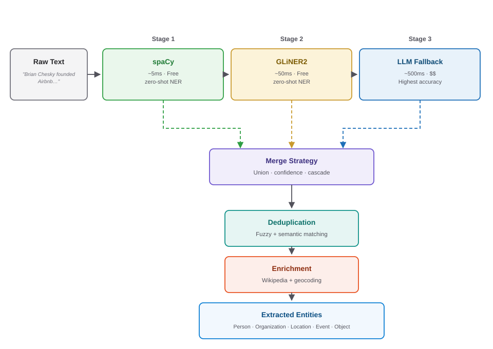
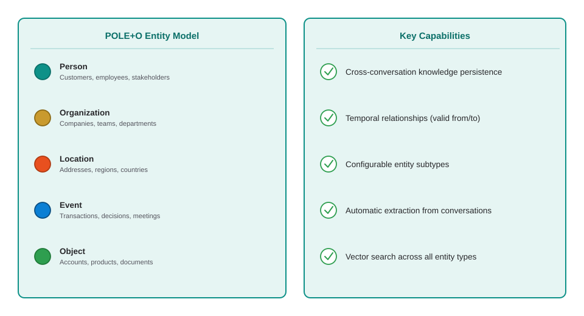

<style>
section {
  --marp-auto-scaling-code: false;
}

li {
  opacity: 1 !important;
  animation: none !important;
  visibility: visible !important;
}

/* Disable all fragment animations */
.marp-fragment {
  opacity: 1 !important;
  visibility: visible !important;
}

ul > li,
ol > li {
  opacity: 1 !important;
}
</style>

# Agent Memory with Neo4j

Giving the Lab 5 supervisor a memory, in the graph it already queries. Lab 6 redeploys that same Model Serving endpoint rather than standing up a second one.

---

## The Agent You Built Is an Amnesiac

- **Lab 5 shipped this:** one supervisor, three tools, one endpoint. It routes well and answers well
- **Ask it about `N10013`.** Then ask "any maintenance events on that aircraft?" and it has no idea what *that* means
- **At the start of question two it holds** the question, the schema, and the prompt. Nothing about question one
- **Close the notebook** and everything it worked out is gone

**"Most agents you build today are amnesiacs."**

<!--
1.0 minute. Not a criticism of Lab 5. The supervisor is stateless by construction, and that is the correct default until you decide otherwise on purpose.
-->

---

## Three Layers of Agent Memory

- **Short term memory**
  - Current context
  - Compression, relevancy
  - Integrate tool results
- **Long term memory**
  - Episodic
  - Semantic / structural
  - Procedural / instructional
- **Reasoning memory**
  - Tool call traces
  - Reasoning traces
  - Previous decisions

<!--
0.5 minutes. The taxonomy the rest of the deck is built on. Read the three headers, not every sub-bullet.
-->

---

## Short-Term Memory

Conversation history and session state with automatic entity extraction

- **Conversation storage.** Sessions and messages persisted as graph nodes with metadata
- **Multi-stage entity extraction.** Pipeline combining spaCy, GLiNER, and LLM extractors with configurable merge strategies
- **Entity resolution.** Multi-strategy dedup: exact, fuzzy, and semantic matching with type-aware resolution

```python
session = await memory.add_session("user_123")
await memory.add_message(session.id, role="user",
    content="Review Jessica's account")
```

<!--
1.0 minute. Three properties: sessions and messages are graph nodes, extraction is multi-stage, resolution is multi-strategy. The pipeline behind that middle bullet gets its own slide next.
-->

---

## Entity Extraction Pipeline

Neo4j agent memory's multi-stage extractor: cheap and fast first, escalate only when it has to



<!--
1.5 minutes. The cascade is the point: try the cheap zero-shot extractor first, escalate only when confidence needs it, merge what all three stages found.
-->

---

## Long-Term Memory

Persistent knowledge graph of entities, relationships, and learned preferences



<!--
1.5 minutes. POLE+O on the left is the entity model; the five capabilities on the right are what that model buys you, chiefly the temporal relationships row, since a preference that can expire is what lets memory be corrected later without deleting the old belief.
-->

---

## Reasoning Memory

Decision traces, tool usage audits, and provenance — the layer that makes AI explainable

- **Tool call traces.** Every tool invocation, parameters, results — complete audit trail
- **Decision provenance.** Why did the agent choose this path? Causal chain fully recorded
- **Learning from experience.** Agent checks if it solved something similar before, reuses successful patterns
- **Compliance & debugging.** When something goes wrong, you can trace exactly what happened and why

<!--
1.0 minute. This is the layer a vector store has nowhere to put.
-->

---

## Why Graphs for Agent Memory?

- **Relationships are first-class.** Connections between entities, decisions, and events are the data, not an afterthought
- **Multi-hop traversal.** Follow chains: Customer → Account → Transaction → Decision → Policy → Employee
- **Structural similarity.** Graph embeddings (FastRP) find similar situations by network topology, not just text
- **Explainable decisions.** Full provenance chain: trace exactly how and why every decision was made
- **Cross-session knowledge.** Information learned in one conversation is available in all future interactions
- **Production ready.** Neo4j: ACID compliance, enterprise scale, proven technology

<!--
1.5 minutes. The thesis slide for the whole deck: every bullet above is a reason the graph, not a vector store, is where memory lives.
-->

---


