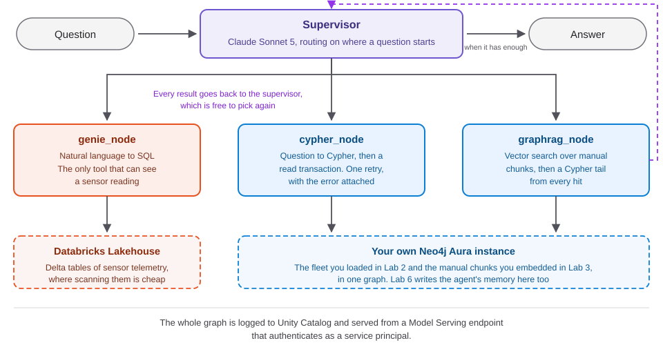

<style>
section {
  --marp-auto-scaling-code: false;
}

li {
  opacity: 1 !important;
  animation: none !important;
  visibility: visible !important;
}

/* Disable all fragment animations */
.marp-fragment {
  opacity: 1 !important;
  visibility: visible !important;
}

ul > li,
ol > li {
  opacity: 1 !important;
}
</style>

# The Supervisor Agent and Deployment

One supervisor, three tools, one endpoint that answers for someone else

---

## Why a Single Retriever Is Not Enough

- **Vector, vector-Cypher, Text2Cypher:** three retrieval patterns, one shape of question each
- **Users do not name a pattern.** They ask "What causes turbine bearing wear?" or "Which aircraft have engines with components that had recent faults?"
- One retriever answers one shape of question. Real questions do not arrive sorted by shape.

---

## What Is an Agent: Components and Tools

An agent wraps retrievers in a reasoning loop, with four parts:

| Component | What It Does |
|---|---|
| **Perception** | Reads the question, the history, the tool descriptions |
| **Reasoning** | Decides which tool fits the question |
| **Action** | Calls a tool: a function the agent can invoke |
| **Response** | Returns a grounded answer in natural language |

Retrievers become tools. The agent matches a question to a tool description, not to a retriever's name.

---

## The ReAct Loop

**ReAct**: Reason, then Act, then Observe, then Respond, or loop again.

```
1. Receive: "How many critical events does Engine #1 on N10001 have?"
2. Reason: this asks for a count
3. Act: call the database query tool
4. Observe: result = 7
5. Respond: "Engine #1 on N10001 has 7 critical maintenance events."
```

Complex questions cycle more than once. The supervisor ahead is this same loop, run over three stores instead of one.

---

## What Lab 5 Assembles

- **Lab 2** gave you a fleet graph: aircraft, systems, components, flights, maintenance history, in your own Aura instance
- **Lab 3** gave you the manuals: chunked, embedded, with a retriever that walks out from a matched passage
- **Lab 4** gave you a Genie Agent: natural language to SQL over the Lakehouse telemetry
- **None of the three answers a real question alone.** This lab builds what decides which one to reach for

<!-- Nothing here is new data, and the routing decision is the hard part. Lab 4's compound agent demo built this from a form in Agent Bricks; this lab writes it in code, with the rule visible. -->

---

## The Shape of the Agent



Nothing in this graph writes to Neo4j.

<!-- Five nodes, one decision: the supervisor picks a tool or picks synthesize. Every tool reports back rather than answering; point at those arrows, the slide's real content. -->

---

## The Three Tools, and the Loop That Calls Them

- **`genie_node`:** SQL over Delta telemetry, through the Genie Agent. The only tool that can see a reading
- **`cypher_node`:** text to Cypher over your own Aura instance, read-only, one retry with the error carried back to the model
- **`graphrag_node`:** a `VectorCypherRetriever` over the Lab 3 manual chunks, with a Cypher tail run from each hit
- **Every tool edge points back to the supervisor.** It sees the result and can pick again, so one question can reach two stores
- **The decision returns as JSON**, constrained by a schema, not read out of prose

<!-- No Reading nodes in Neo4j is a Lab 2 design choice, so every measurement question routes to the Genie Agent. MAX_TOOL_CALLS is the backstop; the prompt's stopping rule is what actually works. ROUTE_SCHEMA forces a reason field nobody reads, because writing one down sharpens the choice. -->

---

## Wiring the Graph

```python
builder = StateGraph(AgentState)
builder.add_node("supervisor", supervisor_node)
builder.add_node("genie_node", genie_node)
builder.add_node("cypher_node", cypher_node)
builder.add_node("graphrag_node", graphrag_node)
builder.add_node("synthesize", synthesize_node)
builder.add_edge(START, "supervisor")
builder.add_conditional_edges("supervisor", route_from_supervisor, {...})
for tool_name in ("genie_node", "cypher_node", "graphrag_node"):
    builder.add_edge(tool_name, "supervisor")
builder.add_edge("synthesize", END)
```

State is a `TypedDict`: `question`, `route`, `trace`, `findings`, `answer`.

<!-- Not the interesting part of the lab. Each node returns what changed; trace is the ordered list of tools called, read later by the routing measurement. -->

---

## The Pair the Model Gets Wrong, and Where to Route It

**`cypher_node` and `graphrag_node` both end in a Neo4j traversal.**

```cypher
WITH node
OPTIONAL MATCH (previous:Chunk)-[:NEXT_CHUNK]->(node)
OPTIONAL MATCH (node)-[:NEXT_CHUNK]->(following:Chunk)
MATCH (node)-[:FROM_DOCUMENT]->(doc:Document)
OPTIONAL MATCH (doc)-[:APPLIES_TO]->(a:Aircraft)-[:HAS_SYSTEM]->(s:System)
```

That is the GraphRAG tail: the passage and the aircraft are one hop away, not in the embedding.

**Describing tools by what they do at the end cannot tell these two apart.** Route on where the question starts instead:

| Question | Route | Why |
|---|---|---|
| "What maintenance events did N10004 have?" | `cypher_node` | N10004 is a node |
| "What is the procedure for an EGT exceedance?" | `graphrag_node` | EGT, Exhaust Gas Temperature, is a phrase in a manual, not a node |

<!-- The Cypher tail is what makes graphrag_node worth having, and also what makes routing hard. Tune the prompt by adding the pair that went to the wrong tool, then rerun the measurement. Worth knowing before someone opens tools.py: the current 213-word prompt does not state this rule, and routes both rows here correctly 5 times out of 5 anyway. It is how to think about the pair, not a line the model needs read to it. What the prompt does keep is the case the model cannot infer, a documented limit being a graph property rather than a reading. -->

---

## Two Prompt Rules, Each Bought with a Measured Failure

**The wiring is thirty lines. The prompt is the lab.**

**Rule One, the direction rule.** An `AFFECTS_AIRCRAFT` arrow written backwards matched nothing and returned zero rows with no error, on an aircraft that has maintenance events.

```cypher
// Wrong: arrow points away from the named noun, matches nothing
(:Aircraft {tail_number: 'N10004'})-[:AFFECTS_AIRCRAFT]->(:MaintenanceEvent)
// Right: the arrow runs FROM the event TO the thing affected
(:MaintenanceEvent)-[:AFFECTS_AIRCRAFT]->(:Aircraft {tail_number: 'N10004'})
```

**Rule Two, never substitute a limit for a measurement.** Asked for the aircraft with the highest average vibration, `cypher_node` answered with an `OperatingLimit.maxValue`: a shared ceiling, not a reading. For any measured-value question, return exactly:

```cypher
RETURN 'The graph holds no sensor readings.' AS cannot_answer
```

<!-- Zero rows with no error is the worst failure mode: valid query, healthy database, confidently empty answer. Fixed with schema text in the prompt, not an undirected pattern, which would have shipped a habit Lab 1 argues against. The refusal string is exact, so synthesis can recognize it instead of papering over a limit. -->

---

## Measured Routing

Twelve questions, four per tool, scored on the first tool the supervisor chose.

| Slice | Accuracy |
|---|---|
| Overall | 12/12 (100%) |
| **`cypher_node` vs `graphrag_node` alone** | **8/8 (100%)** |

Re-run 2026-08-09 against the current 213-word `SUPERVISOR_PROMPT`, five passes rather than one. Every pass identical, 60 out of 60, no spread. The 865-word prompt it replaced scored the same 12/12 on 2026-08-08.

<!-- Both tools end in a graph traversal, so that pair is where routing fails first. Read the last sentence out loud: a prompt a quarter the length scores the same, which is what this set can tell you and also the limit of what it can tell you. Twelve questions no longer separate the two prompts, so the real comparison is the 17-question ablation in test-prompt/, where the short prompt scored 1.000 and the long one 0.982. A number without a date and a prompt version is decoration; Section 9 reproduces the figure above. -->

---

## The Anchor Question

> Which engines are showing abnormal EGT readings, what maintenance history do those aircraft have, and what does the maintenance manual say to do about high EGT?

**Routed `genie_node`, then `cypher_node`, then `graphrag_node`, in a single pass.**

1. **Genie** named the engines carrying abnormal EGT
2. **The graph** returned the maintenance history for those aircraft, including a bearing wear fault with its corrective action
3. **The manual** closed with the guidance for high EGT: trend data for margin degradation, oil spectrographic analysis, fuel filter differential pressure, and a borescope camera inspection of the HPT, the High-Pressure Turbine, nozzle and blades

One question, three tools, one answer. **No single store can answer it.**

<!--
This is the demo the whole workshop builds toward. Run it live if
the room has a working agent, and show the route line before the
answer.

The supervisor was not told to use three tools. It worked the
sequence out from the question, one call at a time, with each
result in front of it when it chose the next.

The order is the natural one and the prompt suggests it: telemetry
finds which aircraft the readings point at, the graph returns that
aircraft's history, the manual returns the procedure.
-->

---

## Degradation, and Why a Bolt Driver Rather Than MCP

- **`VectorCypherRetriever` raises when its index is missing.** The builder checks first: no `maintenanceChunkEmbeddings` index means `graphrag_node` is dropped from `available_tools`, and the routing enum narrows to what actually exists
- **The graph still compiles and still answers** from telemetry and the fleet graph. Running Lab 3 notebook 01 brings the third tool back with no other change
- **The Lab 4 demo reached Neo4j through an MCP server**, the right shape for a governed, admin-managed instance. Your Aura instance is yours: its password sits in the secret scope Lab 1 wrote, and the Neo4j Python driver opens a Bolt session against it in one line
- **Governance pays when the graph is shared.** It costs more than it returns when the graph has exactly one user

<!-- Tool sets discovered at build time degrade; assumed at import time they fail. Not MCP being wrong, just the wrong shape for one user. No plaintext password is typed anywhere in Lab 5's normal path. -->

---

## Deploying the Agent: What Actually Changes

- **A notebook demo runs with your permissions.** It works because you happen to have them
- **An endpoint runs as its own identity**, a service principal Model Serving creates, starting with access to nothing
- **Every resource it touches has to be granted to that identity explicitly.** That is the whole line between a notebook that works and a product that works for someone else

| Question a reviewer asks | Where the answer lives |
|---|---|
| What can it reach? | Only what is declared at log time, in `build_resources` |
| Where do secrets live? | A secret scope, referenced, never copied |
| What is auditable? | A Unity Catalog model version and an MLflow trace per request |

<!-- Nothing about the agent's logic changes, only who is asking. This reviewer table is the one to build early; the rest of this section expands it. -->

---

## The Wrapper: MLflow `ResponsesAgent`

The graph is not served directly. It is wrapped.

```python
class FleetOpsAgent(ResponsesAgent):
    def predict(self, request: ResponsesAgentRequest) -> ResponsesAgentResponse: ...
    def predict_stream(self, request: ResponsesAgentRequest) -> Iterator[...]: ...

AGENT = FleetOpsAgent()
set_model(AGENT)
```

- **A compiled graph is an object in memory**, holding an open driver and a live session
- **`ResponsesAgent`** is the interface Model Serving speaks: one request in, output items out
- **`set_model(AGENT)`** makes the file the model rather than a library beside it

<!-- A LangGraph object must be rebuilt from nothing on a machine no one logged into. Connections open on the first request, not at load, so a failure answers with its reason instead of hiding in build logs. -->

---

## Register to Unity Catalog: Resources vs Credentials

```python
mlflow.set_registry_uri("databricks-uc")
logged = mlflow.pyfunc.log_model(
    name="agent",
    python_model="agent.py",           # models-from-code, not a pickle
    resources=RESOURCES,               # everything the endpoint may reach
    pip_requirements=PIP_REQUIREMENTS, # pinned, not inferred
    registered_model_name=UC_MODEL_NAME,
)
```

- **Databricks objects are declared and granted:** `DatabricksGenieSpace`, `DatabricksSQLWarehouse`, `DatabricksTable`, `DatabricksServingEndpoint`. A Genie grant is not a warehouse grant
- **Everything else is a credential and travels as a reference:** `NEO4J_PASSWORD` arrives as `{{secrets/<scope>/neo4j-password}}`
- **The trap:** log the Genie Agent without its warehouse and it deploys cleanly. Every sensor question then fails, `not authorized to use or monitor this SQL Endpoint`

<!-- Models-from-code means agent.py ships as source, not a pickle. Aura cannot be granted, so it travels as an environment variable resolved at startup; dbutils does not exist in a serving container, which is why agent.py reads os.environ instead. The warehouse omission fails late and quietly: healthy endpoint, broken telemetry only. -->

---

## Deploy, Then Score

```python
mlflow.set_experiment(f"/Users/{CURRENT_USER}/{ENDPOINT_NAME}")
deployment = agents.deploy(
    UC_MODEL_NAME, MODEL_VERSION,
    endpoint_name=ENDPOINT_NAME,
    environment_vars=ENVIRONMENT_VARS,
    scale_to_zero=True,
)
```

`agents.deploy` creates the endpoint, attaches the version, applies the environment block, and grants the declared resources. A first deploy takes roughly sixteen minutes; the call returns in under one.

```python
results = mlflow.genai.evaluate(
    data=EVAL_PAIRS,
    predict_fn=predict_fn,        # calls the endpoint, not a notebook copy
    scorers=[routing, Correctness(), RelevanceToQuery()],
)
```

**Low `Correctness` with `routing` at 1.0 is a prompt or data problem. Low `routing` is a supervisor problem.**

<!-- Set the experiment before deploying, or the endpoint produces no traces. routing needs no judge; predict_fn scores the deployed endpoint's own permissions, not a notebook copy. -->

---

## The Names Are a Contract

```python
model_name(scope)     # databricks-neo4j-workshop.agents.fleet_ops_assistant_<you>
endpoint_name(scope)  # fleet-ops-assistant-<you>
```

- **Functions in `agent.py`**, not strings a participant types. Renaming either breaks Lab 6, which redeploys *this* endpoint with memory added rather than standing up a second one
- **Both carry the participant's slug**, taken from the same secret scope the credentials come from. The endpoint has to: its name is unique across the account. The model does too, so that thirty people are not registering versions into one model the first of them owns
- **Two write privileges pay for it:** `CREATE MODEL` on the `agents` schema to register, and `CREATE TABLE` on the same schema because every `agents.deploy` creates inference tables beside the model. Both granted to the class at provisioning time. No `MODIFY`, so nobody can touch anybody else's model

<!-- Model name, endpoint name and credentials all trace to the same secret scope so they cannot drift. Do not rename these: Lab 6 expects the same model and endpoint back. -->

---

## Summary

- **One supervisor, three tool nodes**, over Delta telemetry, your own graph, and the Lab 3 manual chunks, looping back to itself until every part of a question has an answer against it
- **`cypher_node` and `graphrag_node` are adjacent** because GraphRAG has a Cypher tail. Route on where the question starts, not on what a tool does at the end
- **Two prompt rules, each bought with a measured failure:** a backwards arrow that returned zero rows silently, and a limit returned as a measurement
- **Deployed, the graph becomes an endpoint** with its own identity: resources declared and granted, credentials referenced, the model logged as readable source
- **That endpoint is a building block, too:** registered as a serving endpoint, it is what an Agent Bricks Supervisor can route to alongside a Genie Agent with no orchestration code, the same shape Lab 4's instructor demo showed over MCP

<!-- If one thing survives the day: describe the question, not the tool. A no-code Agent Bricks Supervisor can compose this endpoint with other agents the same way the lab composed three tools. -->
