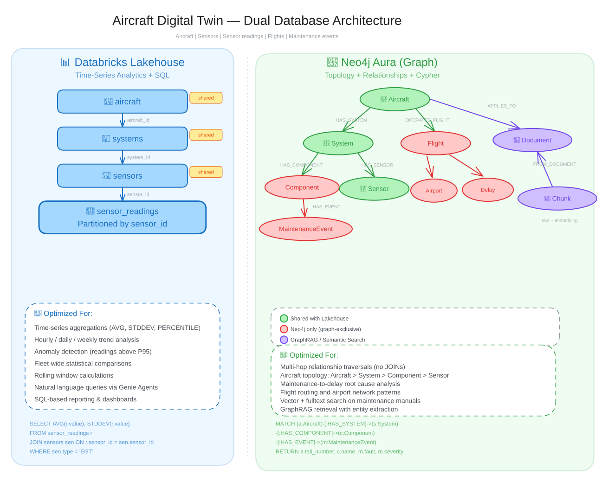
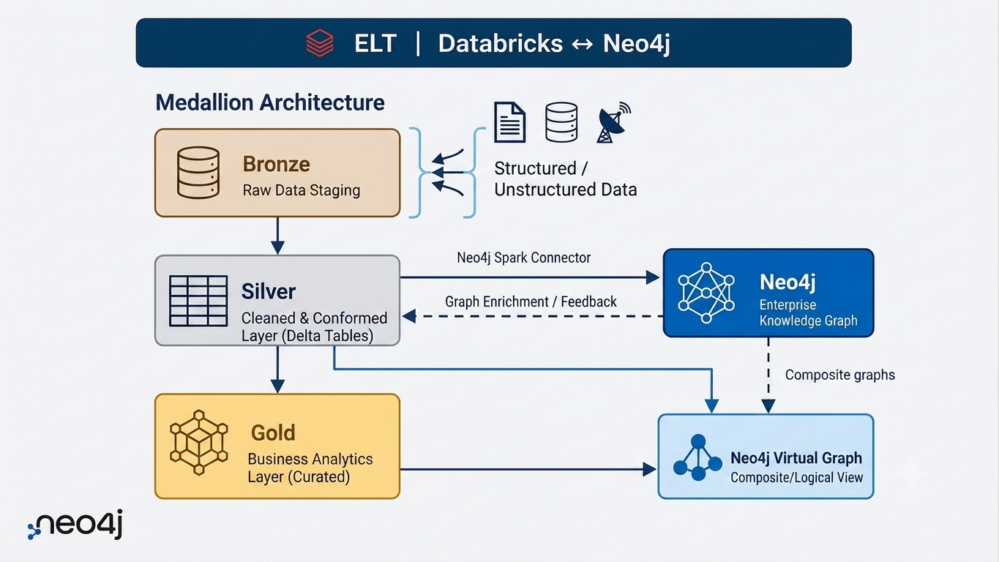

# Workshop Architecture and Roadmap

Aircraft Digital Twins with Neo4j and Databricks

---

## What You Will Build

- **Load** aircraft fleet data into a Neo4j knowledge graph using the Spark Connector
- **Add** semantic search with vector embeddings and GraphRAG retrievers
- **Query** sensor telemetry in natural language with a Databricks Genie Agent
- **Build** a LangGraph supervisor that routes across Genie, Cypher over your own graph, and GraphRAG
- **Give** that agent memory stored in the same graph as the fleet data
- **Watch** the instructor build the same routing with no code in Agent Bricks over a governed Neo4j MCP connection

<!--
Lab 4 splits in two: Part A is the Genie Agent every participant
builds, Part B is an instructor demo participants only watch. Lab 5's
supervisor ties Genie, Cypher, and GraphRAG together, Lab 6 adds
memory.
-->

---

## What Is a Digital Twin?

A **digital twin** is a virtual representation of a physical system, its structure, state, and behavior modeled in data.

For an aircraft fleet, that means capturing:
- **Topology:** aircraft, systems, components, sensors, and how they connect
- **Operations:** flights, routes, delays
- **Maintenance:** events, faults, component removals, corrective actions
- **Documentation:** maintenance manuals, procedures, operating limits

<!--
Four kinds of data tied to the same physical aircraft: the parts, the
flights, the repairs, and the manuals that explain how to fix them.
-->

---

## Why Knowledge Graphs for Digital Twins?

Digital twins are fundamentally about **relationships**: a component belongs to a system, a system belongs to an aircraft, a fault affects a component.

**Knowledge graphs model this naturally:**
- Entities become **nodes** with properties
- Connections become **relationships** with types and properties
- Multi-hop traversals are native, no expensive joins
- The graph **is** the twin: query it, reason over it, extend it

Tables can store the same data, but "which components caused flight delays" means chaining joins across many tables. In a graph, it is one traversal.

<!--
Tabular storage holds the twin's data fine. Anything shaped like "how
is X connected to Y" gets expensive in SQL fast, and stays cheap in
Cypher no matter how many hops deep the question goes.
-->

---

## The Aircraft Digital Twin Dataset

The workshop models a multi-model aviation fleet over 90 operational days:

| Entity | Description |
|--------|-------------|
| Aircraft | Tail numbers, models, operators |
| Systems | Engines, Avionics, Hydraulics per aircraft |
| Components | Turbines, Compressors, Pumps |
| Sensors | Monitoring metadata |
| Sensor Readings | Telemetry every 4 hours over 90 days |
| Flights | Departure/arrival information |
| Maintenance Events | Fault severity and corrective actions |
| Airports | Route network |

<!--
Sensor Readings is the one entity that lives in Databricks, and it is
the highest-volume one by a wide margin. Every other row in this table
has a home in the graph.
-->

---

## Dual Database Architecture

The data splits across two platforms, each chosen for the workload it handles best.

**Databricks Lakehouse:** time-series sensor telemetry
- Readings every 4 hours across 90 days
- Columnar storage and SQL for aggregation, trend analysis, statistical comparison

**Neo4j Aura:** richly connected relational data
- Aircraft topology, component hierarchies, maintenance events, flights, delays, airport routes
- Native multi-hop traversal, no expensive joins

A multi-agent supervisor routes questions to the right database automatically.

<!--
Databricks owns the high-volume time series, a columnar workload.
Neo4j owns the connected data, a traversal workload. Lab 5's
supervisor decides, per question, which side to ask.
-->

---

<!--
Databricks tables on one side, the Neo4j graph on the other, join
points where the same entity, aircraft, systems, sensors, exists in
both. The Spark Connector is the bridge between them.
-->

---

## Why Combine Databricks and Neo4j?

- **Databricks:** tables, aggregations, time-series, ML at scale
- **Neo4j:** relationships, patterns, structure
- Most problems need **both**

<!--
Databricks excels at large volumes of data, aggregations, and machine
learning over tables. Neo4j excels at understanding how things
connect. Most real-world problems need both.
-->

---

## The Medallion Architecture

- **Bronze:** raw data lands from cloud storage, no transformation
- **Silver:** cleaned, typed, governed tables; the Spark Connector reads from here
- **Gold:** business-ready outputs enriched by graph insights, for example maintenance alerts, component health scores, ML features
- **Bidirectional flow:** data flows forward through the layers, graph insights flow back

<!--
Bronze is the raw landing zone. Silver is schema enforcement and
column renaming, tail_number becomes aircraft_id, and it feeds the
Spark Connector. Gold is where graph algorithm results, component
criticality scores, community groupings, write back as columns
alongside operational data that never left the lakehouse. Silver
feeds the graph, Gold captures what the graph discovers.
-->

---

## The Intelligence Platform: Where the Pattern Goes Next

This diagram shows a production pattern, not this workshop's build. No lab here creates a Neo4j Virtual Graph or composite graphs.

<!--
This is where a team takes the workshop's pattern once they operate
at enterprise scale, so read it as "later," not "Lab 2." The
Medallion Architecture with Neo4j attached to it. Structured and
unstructured sources land in Bronze as raw staging. Bronze feeds
Silver, the cleaned and conformed Delta tables, and Silver is the
layer everything else reads from.

Two arrows leave Silver. The Neo4j Spark Connector batch-loads Silver
tables into the Neo4j Enterprise Knowledge Graph as nodes and
relationships. The dashed arrow coming back is graph enrichment:
algorithm results, community scores, and derived relationships
written back into Silver so they become ordinary columns other
consumers can join on. That round trip is the point. Silver feeds the
graph, the graph feeds Silver.

Silver also flows down to Gold, the curated business analytics layer.

The Neo4j Virtual Graph on the lower right is a composite, logical
view rather than a second copy of the data. Silver and Gold tables
project into it, and the dashed line from the Enterprise Knowledge
Graph shows composite graphs stitching the materialized graph and the
lakehouse tables into one queryable surface. An agent asking a Cypher
question does not need to know which side a given property physically
lives on. This workshop's graph is a direct load, not a virtual
projection, so none of this appears again until you take the pattern
into production.
-->

---

## Neo4j Connection Patterns by Platform Stage

- **Data Pipeline:** Neo4j Spark Connector, batch writes
- **Knowledge Graph Construction:** neo4j-graphrag-python, uses the Neo4j Python driver
- **Data Analytics:** Spark Connector for Graph Data Science reads, plus Unity Catalog JDBC for governed SQL and BI tools
- **GraphRAG Retrieval/Agent:** Neo4j MCP Server, Python driver, Aura Agent

<!--
Each platform stage uses a different connector optimized for its
workload. The Data Pipeline uses the Spark Connector for batch
DataFrame writes into Neo4j. This is the primary path for bulk
loading structured data, and it is what Lab 2 does.

Knowledge Graph Construction uses the Neo4j Python driver directly,
not the Spark Connector. The SimpleKGPipeline from
neo4j-graphrag-python handles chunking, LLM-based entity extraction,
and embedding generation, none of which are Spark operations. This is
Lab 3.

Data Analytics uses both connectors. The Spark Connector provides
first-class GDS integration: invoke PageRank, community detection,
and other graph algorithms directly, get results as DataFrames for ML
features and Gold Delta tables. Neo4j's docs position this as a
"graph co-processor" in existing Spark ML workflows. Unity Catalog
JDBC adds the governed SQL layer: register Neo4j as a JDBC
connection, query graph data via SQL translated to Cypher, join graph
results with Delta tables, and connect BI tools like Power BI and
Tableau through standard JDBC.

GraphRAG Retrieval uses the Neo4j MCP Server to expose schema
inspection and read-only Cypher as agent tools. The Python driver
powers the retrievers underneath, combining vector search with graph
traversal in a single query. This is Lab 4 Part B and Lab 5.
-->

---

## Data Intelligence, Graph Intelligence, or Both?

- **SQL:** total sensor readings per aircraft, a single GROUP BY aggregation
- **Cypher:** components within three hops of a flagged sensor, a single traversal query

Most questions need **both**.

| Question | Platform |
|---|---|
| Total sensor readings per aircraft | Databricks, SQL aggregation |
| Components within three hops of a flagged sensor | Neo4j, graph traversal |
| Find the affected aircraft, then total their flight hours | Both |

| Signal | Stay in SQL | Move to Cypher |
|--------|-------------|----------------|
| Number of hops | 1-2 fixed joins | 3+ or variable depth |
| Query shape | Known at design time | Depends on the data encountered |
| Result type | Aggregated numbers | Paths, subgraphs, connected components |
| Latency requirement | Batch is fine | Sub-second for interactive investigation |
| Data volume per query | Millions of rows scanned | Thousands of entities traversed |

<!--
SQL is built for aggregation, Cypher for traversal. The third row is
why you need both: Neo4j finds the affected aircraft, Databricks
totals their flight hours. This is the same choice Lab 5's supervisor
makes automatically at runtime.
-->

---

## What Each Platform Brings

| | Databricks | Neo4j |
|---|-----------|-------|
| **Stores** | Tables and files | Nodes and relationships |
| **Answers** | How much, how often | How is this connected, what is affected |
| **AI capability** | Foundation Models, Genie | Vector indexes, GraphRAG, MCP |
| **Strength** | Scale, aggregation, ML | Relationships, traversal, pattern matching |

**The Spark Connector** moves data. **MCP** lets agents query the graph directly. Together, the platforms stay connected at every layer.

<!--
The same division of labor as a lookup table: scale on one side,
connections on the other, two connectors keeping them in sync.
-->

---

## Workshop Infrastructure: Shared Resources

Shared resources are pre-configured by administrators so participants can focus on the labs.

| Resource | Description |
|----------|-------------|
| **Databricks Data & Tables** | CSV files in Unity Catalog Volume and pre-created Lakehouse tables |
| **Instructor Demo Aura Instance** | Fully populated Neo4j database behind the optional Lab 4 compound agent demo. Participants never connect to it |
| **Neo4j MCP Server** | External MCP server against the demo instance, used only in that optional demo |
| **Databricks MCP Connection** | That MCP server registered in Unity Catalog, in the instructor's workspace |

<!--
Everything here exists before Day 1. Participants never touch the
instructor's Aura instance, MCP server, or MCP connection.
-->

---

## Workshop Infrastructure: Personal Resources

Each participant gets their own environment to work in.

| Resource | Description |
|----------|-------------|
| **Personal Aura Instance** | Your own Neo4j database, created in Lab 1 and used by every required lab after it |
| **Databricks Workspace** | Clone notebooks and run them on a shared cluster to build your graph and agents |

**Every required lab uses your own instance.** Lab 2 loads the fleet into it, Lab 3 adds the maintenance manual and vector indexes, Lab 5 queries it, and Lab 6 writes agent memory back to it. A broken load shows up in the next lab, which is the point.

**Lab 4's compound agent demo is optional** and runs against a separate instance. You need no credential, no MCP connection, and no setup for it.

<!--
Lab 4 Part B is an instructor demo, not something participants build.
Everything a participant builds runs against the personal Aura
instance created in Lab 1, and every lab after it depends on the one
before.
-->

---

<!--
Shared resources on one side, personal resources on the other. The
only line crossing from shared to personal is the instructor's demo,
and it runs one direction, instructor to audience.
-->

---

## Workshop Roadmap

**Part 1: Foundations, Labs 1 and 2**
- Lab 1: Provision your Aura instance, learn Cypher
- Lab 2: ETL from Databricks into the graph via the Spark Connector

**Part 2: Retrieval, Labs 3 and 4**
- Lab 3: GraphRAG semantic search over maintenance manuals
- Lab 4 Part A: Genie Agent over lakehouse telemetry
- Lab 4 Part B: **instructor demo**, Neo4j MCP and Agent Bricks supervisor, participants watch

**Part 3: The Supervisor Agent, Lab 5**
- Lab 5: LangGraph supervisor over Genie, Cypher, and GraphRAG, deployed to Model Serving

**Part 4: Agent Memory, Lab 6**
- Lab 6: Agent memory written back to Neo4j

<!--
Labs 1 through 3 build the graph and its retrieval layer. Lab 4 is
the split lab: Part A is required, Part B is instructor-only. Lab 5
brings the routing together in code. Lab 6 closes the loop by writing
back to the same graph that Lab 2 built.
-->
