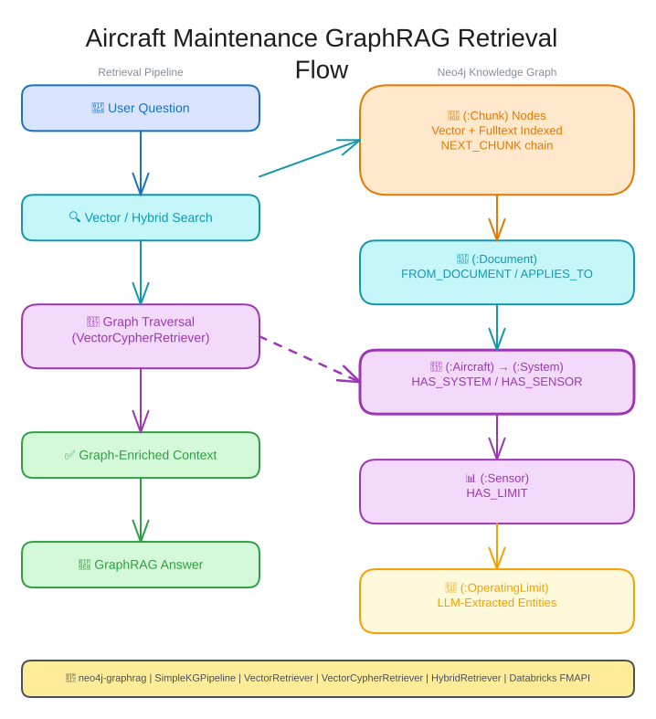

<style>
section {
  --marp-auto-scaling-code: false;
}

li {
  opacity: 1 !important;
  animation: none !important;
  visibility: visible !important;
}

/* Disable all fragment animations */
.marp-fragment {
  opacity: 1 !important;
  visibility: visible !important;
}

ul > li,
ol > li {
  opacity: 1 !important;
}
</style>

# GraphRAG Retrieval

From Vector Search to Graph Retrievers over the Aircraft Digital Twin

<!-- The Business Case deck made the argument and What is a Knowledge Graph built the graph. This one runs the whole retrieval story in one pass: LLM gaps, RAG, vector search, what the graph adds, then the four retrievers that do it in code. The hinge is the "How Graph-Enriched Retrieval Works" slide and the diagram after it. Everything before earns that diagram, everything after implements it. -->

---

## GenAI Limitations

Foundation models are powerful, but they have critical gaps:

- **Hallucination:** generate confident, incorrect answers
- **Knowledge cutoff:** training data has a fixed date, no access to this week's maintenance logs
- **Relationship blindness:** cannot traverse how an aircraft's systems, sensors, and maintenance events connect

These gaps matter when a technician needs a grounded, traceable answer, not a guess.

<!-- One-line recall of the Business Case deck, not a new argument. Say it fast. It exists to set up the next slide: something has to hand the model your data and its relationships at query time. -->

---

## What Is RAG?

**Retrieval-Augmented Generation** gives the LLM relevant context before it answers.

```
User Question
    ↓
Retrieve relevant chunks
    ↓
Pass chunks + question to LLM
    ↓
LLM generates a grounded answer
```

The LLM answers from retrieved evidence, not memory alone. Retrieval quality determines answer quality.

<!-- RAG fixes knowledge cutoff and hallucination by giving the model specific text at question time instead of relying on training memory. The open question is how you find the right text. -->

---

## Embeddings

An **embedding** is a list of numbers that represents the meaning of text, not just its words.

- "Bearing wear on Engine 1" and "turbine component degradation" produce similar vectors, because they describe related faults
- "Bearing wear on Engine 1" and "flight FL00123 departed JFK" produce vectors far apart
- The embedding model reads a chunk of text and outputs a fixed length vector

Embeddings power **semantic search**: matching on meaning rather than exact keywords.


<!-- This is the foundation. Once text becomes a vector, "similar meaning" becomes "nearby points," and finding relevant passages becomes a distance calculation, not a keyword match. -->

---

## Chunking

Maintenance manuals run to hundreds of pages. An LLM cannot process one in a single pass, so each manual is split into **chunks** before extraction and embedding.

Chunk size is a trade-off:

- **Larger chunks:** more context for entity extraction. "The engine" resolves to "CFM56-7B Engine 1" only when the surrounding text is visible
- **Smaller chunks:** more precise retrieval. A search returns the relevant paragraph, not the whole page

**Overlap** between consecutive chunks preserves context at the boundary, so a procedure split across two chunks does not get cut mid-step. A moderate size, 500 to 1000 characters, is a reasonable starting point for maintenance manuals.

<!-- A genuine two-sided trade-off, not a knob to maximize. Lab 3 fixes a specific chunk size for the maintenance manuals; this slide is why that number is not arbitrary. -->

---

## Vector Search

Given a question, the system:

1. **Embeds the question** into a vector, using the same embedding model
2. **Compares** that vector against every stored chunk vector
3. **Returns** the passages closest in meaning, ranked by cosine similarity

Ask "what engine problems occurred" and the system finds chunks about bearing wear and overheat, even though neither chunk contains the words "engine problems."

**Reading the numbers:** cosine similarity above 0.90 is a strong match, below 0.80 is weak. Start at `top_k=5` and adjust from what comes back.


<!-- The smart librarian idea: a catalog search for "dogs" misses a book about "canines." A librarian who has read every book finds it anyway, matching on what the book is about. On the numbers, do not over-teach the score ranges. Participants tune top_k by looking at results, not by memorizing thresholds. -->

---

## Where Vector Search Stops

Vector search returns **isolated passages**: chunk text and a similarity score, with no aircraft, no system, and no link to related events elsewhere in the corpus.

| Question | Why It Fails |
|----------|---------------|
| Which aircraft have engines with critical maintenance events? | Requires traversing Aircraft to System to Component to Event |
| What components share the same fault type across the fleet? | Requires finding a shared pattern across aircraft, not one passage |
| Which flights were delayed by a specific maintenance issue? | Requires aggregation, not similarity |

"Here are chunks about bearing wear." But on which aircraft? Which engine? Is it still flying?

<!-- The hinge of the deck. Everything before explains how traditional RAG works; everything after explains what graph traversal adds, and why it is necessary rather than decorative. Each question in the table is a one line Cypher traversal once the data is in the graph, and unanswerable by similarity search, which has no notion of a relationship at all. -->

---

## Context Rot

Even with context windows growing to hundreds of thousands of tokens, more context does not mean better answers.

**Context rot:** as the volume of retrieved context grows, model accuracy on questions about that context *decreases*. The signal gets diluted by noise.

The fix is not a bigger context window. It is **better retrieval**: finding precisely the right information, and nothing more.

[Source: Chroma Research, Context Rot]


<!-- Dumping every loosely related chunk into the prompt can make the answer worse than a narrower, well targeted retrieval. That is the case for precision over breadth, which is what graph traversal adds. -->

---

## The Two-Layer Graph

```
(:Document)--[:FROM_DOCUMENT]-->(:Chunk {text, embedding})--[:NEXT_CHUNK]-->(:Chunk)
      |
[:APPLIES_TO]
      v
(:Aircraft)--[:HAS_SYSTEM]-->(:System)
```

The top layer is text: chunks with embeddings, linked to their source manual and to each other in reading order.

The bottom layer is structure: the aircraft and systems the manual describes, already built by the Lab 2 data pipeline.

`APPLIES_TO` is the bridge between them.

<!-- Two layers, built at two different times. The bottom layer is the operational graph the Spark Connector loaded in Lab 2. The top layer is what Lab 3 adds: manuals, chunked and embedded. APPLIES_TO connects them. -->

---

## Indexes That Power Search

Beyond the uniqueness constraints used during loading, the graph carries indexes that make retrieval fast, the foundation GraphRAG builds on in Lab 3.

**Vector index**, over Chunk embeddings from the maintenance manuals:
```cypher
CREATE VECTOR INDEX maintenanceChunkEmbeddings IF NOT EXISTS
FOR (c:Chunk) ON (c.embedding)
OPTIONS {indexConfig: {`vector.dimensions`: 1024,
         `vector.similarity_function`: 'cosine'}}
```

**Fulltext index**, `maintenanceChunkText`, supports keyword search over the same chunk text. Two indexes over one set of chunks is what makes the hybrid retrievers later in this deck possible.

**Constraints** enforce uniqueness, on `Aircraft.aircraft_id` and every other node label's key property, so `MERGE` matches an existing node instead of scanning the whole label.

<!-- 1024 dimensions because embeddings always come from the databricks-bge-large-en serving endpoint, cosine similarity for distance. No constraint means no index means a full label scan on every load. Flag the fulltext index as something we come back to; participants who skip notebook 03 never use it, and that is fine. -->

---

## How Graph-Enriched Retrieval Works

1. **Vector search** finds chunks whose meaning matches the question
2. **Graph traversal** follows relationships from each matched chunk:
   - `(Chunk)-[:FROM_DOCUMENT]->(Document)`: which manual?
   - `(Document)-[:APPLIES_TO]->(Aircraft)`: which aircraft?
   - `(Aircraft)-[:HAS_SYSTEM]->(System)`: which system?
   - `(Chunk)-[:NEXT_CHUNK]->(Chunk)`: what comes next, so a split procedure arrives whole
3. **LLM** receives chunk text plus the structured entity context

Without graph context the LLM has to infer all of this from raw text. With it, every entity in the answer is a **verified fact** from the graph.

<!-- NEXT_CHUNK runs sideways, not up or down the layers. Chunk boundaries are arbitrary but procedures are not; a step cut mid-sentence needs its neighbor to read whole. The pitch in one sentence: vector search finds the text, the graph verifies what the text is about. Neither replaces the other. -->

---



<!-- The same traversal as the previous slide, drawn out. Walk it left to right: question, embedding, vector index, matched chunk, then the graph hops to document, aircraft, and system before it lands at the LLM.

Narrate it with a real question: "What maintenance issues affect the turbine on AC1001?" Vector search finds chunks from the maintenance manual discussing turbine wear. FROM_DOCUMENT reaches the manual's Document node, APPLIES_TO reaches Aircraft AC1001, HAS_SYSTEM reaches the Propulsion System. Without the graph hop, the answer is generic turbine advice from whichever manual scored highest. With it, the answer is scoped to AC1001, and the system it names is a fact from the graph, not a guess.

Everything from here on is this diagram in code. -->

---

## Vector Retriever

The simplest retriever. Finds content by meaning, no traversal.

```python
from neo4j_graphrag.retrievers import VectorRetriever

vector_retriever = VectorRetriever(
    driver=driver,
    index_name='maintenanceChunkEmbeddings',
    embedder=embedder,
    return_properties=['text']
)

results = vector_retriever.search(
    query_text="What maintenance procedures apply to engine bearing wear?",
    top_k=5
)
```

**Best for** conceptual questions where the answer sits inside the chunk: "What causes hydraulic system failures?" **Not for** entity-specific questions: "What maintenance events affect Aircraft N10001?" returns chunks about maintenance in general.

<!-- "Engine bearing wear" finds content about "turbine component degradation" even without exact word matches. Driver connects to Neo4j, index name points at the stored embeddings, embedder turns the question into a vector. Each result carries the chunk text and a similarity score. This is the diagram's left half and nothing more: it stops at the matched chunk. -->

---

## Vector Cypher Retriever

**Vector Retriever:** text chunks only.
**Vector Cypher Retriever:** text chunks plus related entities from graph traversal.

**Two-step process:**
1. **Vector search**, semantic, identical to Vector Retriever
2. **Cypher traversal**, structural: from each matched chunk, gather related entities and relationships

**The chunk is the anchor.** Traversal can only start from what vector search finds. Weak vector matches mean weak traversal, no matter how good the Cypher is.

This is the retriever Lab 3 and Lab 5 both build on. Master this one.

<!-- This is the most important retriever in the workshop. Lab 3 builds it, Lab 5's supervisor agent calls it as a tool. Nothing new happens in step one, it is the same vector search as before. Step two is what makes this retriever different: a Cypher query runs on every matched chunk.

On the anchor: ask "What maintenance events affect Aircraft N10001?" and vector search finds general maintenance chunks, so the traversal reaches whatever components those chunks mention, which may not be on N10001 at all. If the question names a specific entity, use Text2Cypher instead. -->

---

## Creating a Vector Cypher Retriever

```python
from neo4j_graphrag.retrievers import VectorCypherRetriever

system_context_query = """
WITH node
// From the matched chunk to its manual, to the aircraft that manual applies to
MATCH (node)-[:FROM_DOCUMENT]->(doc:Document)-[:APPLIES_TO]->(a:Aircraft)
MATCH (a)-[:HAS_SYSTEM]->(s:System)
// OPTIONAL so systems with no components still appear
OPTIONAL MATCH (s)-[:HAS_COMPONENT]->(comp:Component)

WITH node, doc, a, s, comp
RETURN doc.aircraftType AS aircraft_type,
       a.tail_number AS aircraft,
       COLLECT(DISTINCT s.name)[0..3] AS systems,
       COLLECT(DISTINCT comp.name)[0..3] AS components,
       node.text AS context
"""

retriever = VectorCypherRetriever(
    driver=driver,
    index_name='maintenanceChunkEmbeddings',
    embedder=embedder,
    retrieval_query=system_context_query
)
```

<!-- Verbatim from Lab 3 notebook 02. Same driver, index, and embedder as VectorRetriever, plus one new argument: retrieval_query. The library runs the vector search automatically and hands this query `node` and `score`. Everything after is plain Cypher: reach the manual, cross APPLIES_TO to the aircraft, then collect its systems and components. Cypher comments use two forward slashes.

Do not skip the OPTIONAL MATCH. A plain MATCH there filters the whole row out, so a chunk about a system with no components recorded never reaches the LLM at all. The retrieval query runs per matched chunk, so one missing relationship silently loses a result. -->

---

## Hybrid Retrievers

Vector search matches by meaning, and smooths over exact strings: `V2500`, `925`, a part number, a fault code. Fulltext search matches by word and catches them. **Hybrid search runs both and merges the ranked lists.**

```python
from neo4j_graphrag.retrievers import HybridRetriever

hybrid_retriever = HybridRetriever(
    driver=driver,
    vector_index_name='maintenanceChunkEmbeddings',
    fulltext_index_name='maintenanceChunkText',
    embedder=embedder,
    return_properties=['text']
)
```

`HybridCypherRetriever` takes the same two indexes and adds a `retrieval_query`, so hybrid search finds the chunks and Cypher traverses out from them.

<!-- The two-by-two: search by meaning or by meaning plus keywords, return chunk text or chunk text plus a traversal. Four retrievers, two arguments' difference between them.

Notebook 03 is optional and builds both hybrid retrievers, then runs the same three questions through Vector and Hybrid side by side. The technical query, "V2500 EGT limit 925 degrees," is where hybrid pulls ahead. Its operating-limit example walks Chunk to Document to Aircraft to System to Sensor to OperatingLimit, returning the authoritative threshold as structured fields rather than prose, because a compliance answer cannot come from what a model read during extraction. -->

---

## Text2Cypher Retriever

Some questions need precise facts, not semantic search. No embeddings involved: the LLM reads the graph schema and writes Cypher.

**Question:** "How many critical maintenance events does aircraft N10001 have?"
**Generated:** `MATCH (a:Aircraft {tail_number:'N10001'})-[:HAS_SYSTEM]->()-[:HAS_COMPONENT]->()-[:HAS_EVENT]->(e:MaintenanceEvent {severity:'CRITICAL'}) RETURN count(e)`
**Result:** `7`

```python
from neo4j_graphrag.retrievers import Text2CypherRetriever
from neo4j_graphrag.schema import get_schema

text2cypher_retriever = Text2CypherRetriever(
    driver=driver, llm=llm, neo4j_schema=get_schema(driver)
)
```

**Security:** this executes LLM-generated queries. Use read-only credentials, validate for DELETE and DROP, enforce LIMIT, log every generated query.

<!-- get_schema pulls the actual node labels, property types, and relationship patterns from the live graph. Without that schema the LLM guesses and invents properties that do not exist.

Best for counts, lists, and aggregations. It fails when the question does not map to the schema: "What's the sentiment about this fault?" has no sentiment property to query. Generated Cypher can also carry syntax errors or slow patterns, so validate before trusting it. The security line is not optional in production. -->

---

## The GraphRAG Class

Retrievers find context. The **GraphRAG** class combines a retriever with an LLM to produce a grounded answer in one call.

```python
from neo4j_graphrag.generation import GraphRAG

rag = GraphRAG(
    retriever=vector_retriever,   # any retriever type
    llm=llm
)

response = rag.search(
    query_text="What maintenance procedures apply to engine bearing wear?",
    retriever_config={"top_k": 5}
)
print(response.answer)
```

Swap `vector_retriever` for any of the other three to change the retrieval strategy without touching another line.

<!-- This closes the loop: the retriever finds context, GraphRAG hands that context to the LLM, and the LLM generates the answer. The retriever type is a swap-in argument, nothing else changes. That is why the labs can compare retrievers by editing one word. -->

---

## External Vector Stores: Databricks Vector Search

GraphRAG's vector store is pluggable. If a team already uses **Databricks Vector Search**, vectors stay in the Lakehouse while Neo4j supplies graph context.

```python
from neo4j_graphrag.retrievers import ExternalRetriever

retriever = ExternalRetriever(
    driver=driver,
    id_property="chunkId",
    external_embedder=databricks_embedder,
    fetcher=databricks_vector_search_fetcher
)
```

| Vector Store | How It Works |
|---|---|
| **Neo4j, built-in** | Vectors and graph in one database, simplest setup |
| **Databricks Vector Search** | Vectors stay in the Lakehouse alongside Delta tables |

The external store runs the similarity search and returns matching IDs. Neo4j resolves those IDs to nodes and traverses the graph.

<!-- The graph context is the value-add regardless of where the vectors live. Teams already invested in Databricks Vector Search keep their existing embeddings pipeline and still get graph enrichment. -->

---

## Choosing the Right Retriever

| Question Pattern | Best Retriever | Why |
|---|---|---|
| "What causes...", "Describe..." | Vector | Semantic, conceptual content |
| "Which [entities] are affected by..." | Vector Cypher | Content plus related entities |
| Names a code, part number or threshold | Hybrid | Fulltext catches the literal token |
| A code or threshold, plus relationships | Hybrid Cypher | Literal match, then traverse |
| "How many...", "List all..." | Text2Cypher | Precise counts and lookups |

Ask three questions: content or facts? Do I need related entities? Does the wording carry exact terms? The answers point at one row.

<!-- Keep this table on hand while building Lab 3 and Lab 5. Most real questions lean toward one row clearly. The hero question on the next slide is the exception that needs several at once. -->

---

## From Retrievers to Agent Tools

> "Which engines are showing abnormal EGT readings, what maintenance history do those aircraft have, and what does the maintenance manual say to do about high EGT?"

- **Abnormal EGT readings:** Genie Agent over Lakehouse sensor telemetry. EGT is Exhaust Gas Temperature
- **Maintenance history:** Vector Cypher Retriever, traversing from aircraft to their maintenance events
- **What the manual says:** Vector Retriever, semantic search over manual chunks

The Lab 5 supervisor agent wraps each retriever as a tool and routes each part of the question to the one that answers it.

<!-- This single question needs several retrieval patterns plus the Genie Agent. No one tool answers it alone. The next deck covers the LangGraph supervisor: how it decides which tool to call for which clause, and how it stitches the answers together. -->
