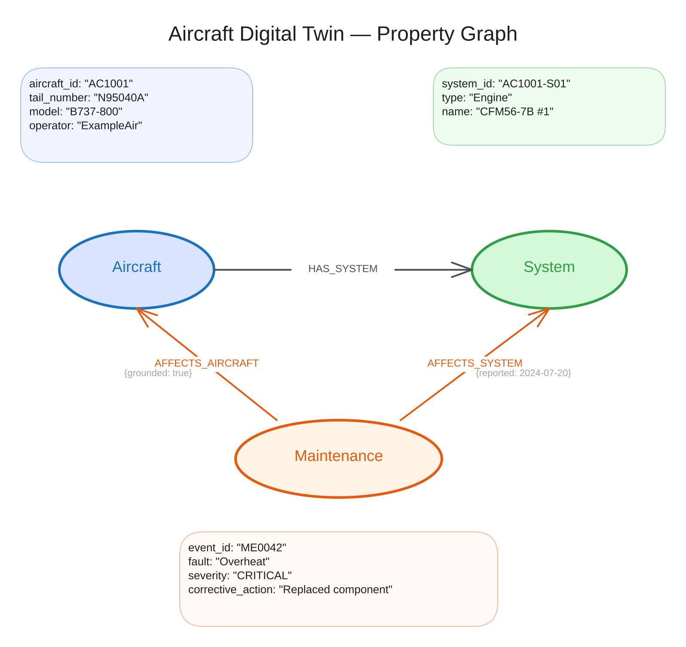
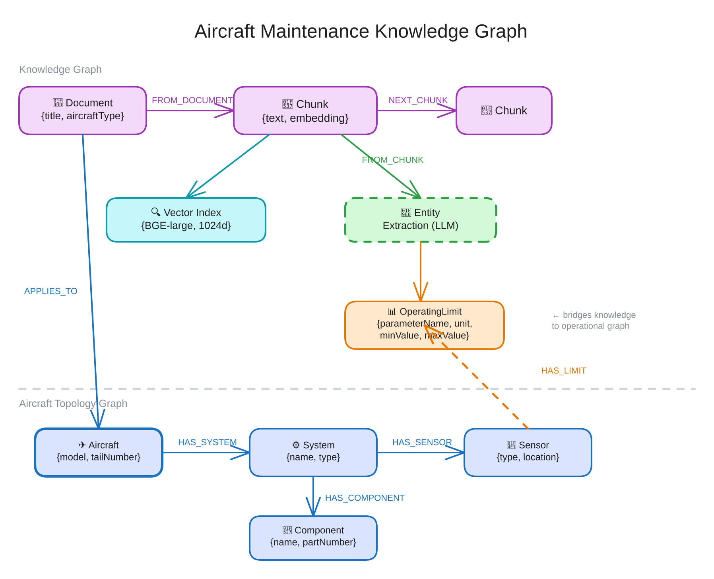

<style>
section {
  --marp-auto-scaling-code: false;
}

li {
  opacity: 1 !important;
  animation: none !important;
  visibility: visible !important;
}

/* Disable all fragment animations */
.marp-fragment {
  opacity: 1 !important;
  visibility: visible !important;
}

ul > li,
ol > li {
  opacity: 1 !important;
}
</style>

# What is a Knowledge Graph

Graph databases, Cypher, and the aircraft digital twin graph

---

## What Is a Graph Database?

A graph database models data as **nodes** and **relationships**.

- **Nodes** represent entities: aircraft, systems, components, sensors, maintenance events
- **Relationships** represent connections: `HAS_SYSTEM`, `HAS_COMPONENT`, `HAS_EVENT`
- **Properties** are key-value pairs on both nodes and relationships

Connections are **stored as first-class structures**, not computed at query time through joins.

<!-- The whole workshop rests on this reframe: a relational database figures out how rows connect at query time, through a join. A graph database stores the connection itself, as a relationship, at write time. -->

---

## From Graph Database to Knowledge Graph

A graph database stores connections. A knowledge graph gives them **meaning**.

- **Typed entities and relationships:** `Component`, `HAS_EVENT`, `AFFECTS_SYSTEM`, not generic nodes and edges
- **A schema the business recognizes:** aircraft, systems, sensors, maintenance events, the same words a maintenance engineer uses
- **Documents connected to entities:** manual text linked to the parts it describes, which is what Lab 3 builds

An agent reasons over the second one. It cannot reason over the first.

<!-- The distinction pays off three times later. Deck 3's Knowledge Layer slide assumes it, Lab 3's entity extraction produces it, and Lab 5's Cypher tool depends on the schema being legible enough for an LLM to write against. -->

---



<!-- The property graph view of one aircraft: node types, relationship types, and a few properties each carries. We build this shape up piece by piece for the rest of the deck. -->

---

## Graph Notation

Parentheses denote nodes. Brackets denote relationships:

```
(:Aircraft {tail_number})-[:HAS_SYSTEM]->(:System {name})
```

Each Aircraft node carries properties like `tail_number` and `model`. Each HAS_SYSTEM relationship connects an aircraft to one of its systems. The relationship is directional, typed, and stored alongside the nodes it connects.

<!-- This notation reappears in every Cypher query for the rest of the workshop. -->

---

## Graphs vs Relational Databases

**"Which components sit on aircraft N10007's engines?"**

**In SQL:** join aircraft to systems, then systems to components, filtering for engine type at each step.

**In Cypher:**
```cypher
MATCH (a:Aircraft {tail_number: 'N10007'})
      -[:HAS_SYSTEM]->(s:System {type: 'Engine'})
      -[:HAS_COMPONENT]->(c:Component)
RETURN s.name, c.name, c.type
```

The query reads like the traversal it executes.

<!-- Quick preview. A harder question gets the full side-by-side treatment two slides from now. -->

---

<style scoped>
section { font-size: 22px; }
</style>

## The Same Question, Two Languages

**Question:** starting from the component that triggered a critical maintenance event, which other aircraft could share the same root cause through common ground infrastructure?

Answering it means walking Component to System to Aircraft, then fanning out through the flights and airports those aircraft share. Neo4j stores every one of those hops as a relationship. The Databricks gold layer stores four tables, `sensor_readings`, `sensors`, `systems`, and `aircraft`, joined in one fixed chain.

**What SQL reaches:** which other aircraft show elevated readings on the same sensor type.

```sql
WITH origin AS (
  SELECT sen.type, s.aircraft_id
  FROM sensors sen JOIN systems s ON sen.system_id = s.system_id
  WHERE sen.sensor_id = 'AC1001-S01-SN01'
)
SELECT a2.tail_number, a2.model, AVG(r2.value) AS avg_value
FROM origin o
JOIN sensors sen2 ON sen2.type = o.type
JOIN systems s2 ON sen2.system_id = s2.system_id AND s2.aircraft_id != o.aircraft_id
JOIN aircraft a2 ON s2.aircraft_id = a2.aircraft_id
JOIN sensor_readings r2 ON r2.sensor_id = sen2.sensor_id
GROUP BY a2.tail_number, a2.model ORDER BY avg_value DESC
```

<!-- This SQL is real and it runs, but it is a self-join on sensor type: fixed depth, no recursion, one shared signal. The shared ground infrastructure the question asks about lives only in Neo4j. Set up the next slide as the same question, run in full. -->

---

<style scoped>
section { font-size: 22px; }
</style>

## The Same Question in Cypher

Every hop the question needs is stored as a relationship, so the traversal runs as written:

```cypher
MATCH (c:Component {component_id: 'AC1001-S01-C04'})
      <-[:HAS_COMPONENT]-(:System)<-[:HAS_SYSTEM]-(origin:Aircraft)
MATCH (origin)-[:OPERATES_FLIGHT|DEPARTS_FROM|ARRIVES_AT*2..6]-(other:Aircraft)
WHERE other <> origin
RETURN DISTINCT other.tail_number, other.model
```

Searching two hops deeper means changing `*2..6` to `*2..10`. One number, no new tables, no new joins.

<!--
Walk the pattern: the component sits under a system, under an aircraft, and from there the query fans out through Flight and Airport nodes to any aircraft within the hop range. The variable-length pattern is the whole point. In SQL, each extra hop is another join; here it is a digit.

Cypher glossary, if the room needs it:
- `MATCH` finds nodes and relationships that fit a pattern
- `(c:Component {component_id: 'AC1001-S01-C04'})` binds a Component node to variable `c`
- `-[:HAS_SYSTEM]->` follows outbound HAS_SYSTEM relationships
- `RETURN` selects which properties to include in results
-->

---

<style scoped>
section { font-size: 22px; }
</style>

## The Aircraft Digital Twin Graph

Nine node labels carry the fleet, its operating history, and its maintenance record.

| Node Label | Example |
|---|---|
| **Aircraft** | N10000, B737-800, NorthernJet |
| **System** | Engine, CFM56-7B #1 |
| **Component** | Turbine, Fuel Pump, Hydraulic Actuator |
| **Sensor** | EGT, Exhaust Gas Temperature, °C |
| **MaintenanceEvent** | MINOR severity, fault: Bearing wear |
| **Flight** | FL00001, NO571, MIA to PHL |
| **Airport** | JFK, John F. Kennedy International Airport |
| **Delay** | Weather, 40 minutes |
| **Removal** | work order WO2408-0001, OUT_WARRANTY |

<!-- Every node label in the base graph, before Lab 3 layers on Document, Chunk, and extracted-entity types. Sensor readings themselves never appear here, only sensor metadata; measured values live in the Databricks sensor_readings table. -->

---



<!-- The full structure: every node label from the last slide, connected by the relationship types coming up next. -->

---

## Relationships in the Graph

```
(Aircraft)-[:HAS_SYSTEM]->(System)
(System)-[:HAS_COMPONENT]->(Component)
(System)-[:HAS_SENSOR]->(Sensor)
(Component)-[:HAS_EVENT]->(MaintenanceEvent)
(MaintenanceEvent)-[:AFFECTS_SYSTEM]->(System)
(MaintenanceEvent)-[:AFFECTS_AIRCRAFT]->(Aircraft)
(Aircraft)-[:OPERATES_FLIGHT]->(Flight)
(Flight)-[:DEPARTS_FROM]->(Airport)
(Flight)-[:ARRIVES_AT]->(Airport)
(Flight)-[:HAS_DELAY]->(Delay)
(Aircraft)-[:HAS_REMOVAL]->(Removal)
(Removal)-[:REMOVED_COMPONENT]->(Component)
```

**Aircraft** is the central hub. Systems, flights, and removals attach directly to it, and maintenance events affect it even when they start three hops down at a component.

<!-- Twelve relationship types, all directional and typed. AFFECTS_SYSTEM and AFFECTS_AIRCRAFT both radiate from the same MaintenanceEvent, connecting back to two levels of the topology at once. -->

---

## Why This Schema Design

**Separate relationship types** rather than generic RELATES_TO:

- `AFFECTS_SYSTEM` and `AFFECTS_AIRCRAFT` are distinct types
- Cypher filters by relationship type during traversal, which is indexed and fast
- A property filter on a generic relationship requires checking every connection

**Typed relationships** let traversal patterns follow specific paths efficiently.

<!-- The alternative is one CONNECTED_TO type with a {kind: "affects_system"} property. Neo4j indexes relationship types, not arbitrary property values, so typed relationships stay fast as the graph grows. -->
